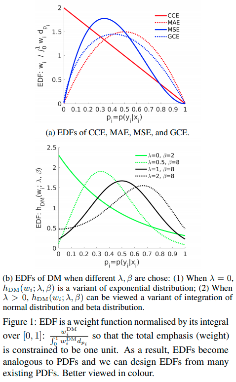
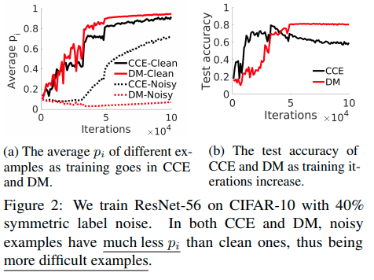
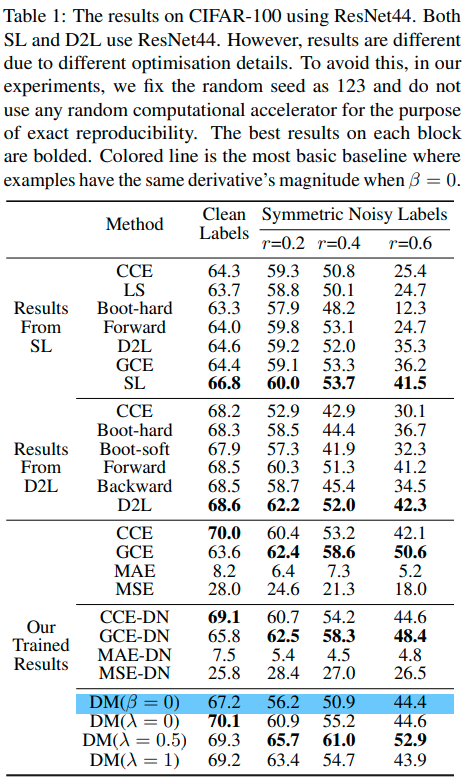
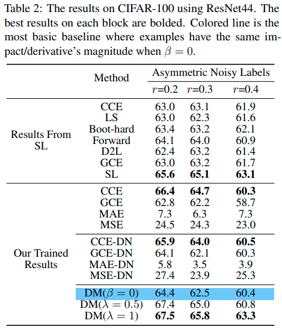
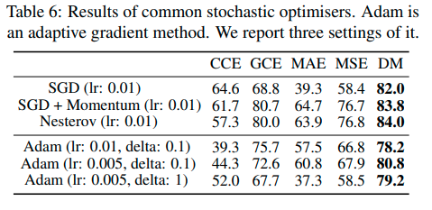
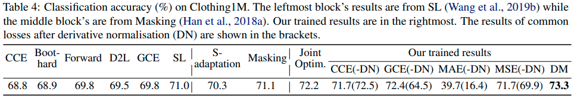

# Derivative Manipulation: A General Example Weighting Framework 

Project page for [Derivative Manipulation: A General Example Weighting Framework ](https://arxiv.org/pdf/1905.11233.pdf). 

### A Framework to design your own Emphasis Density Funtion and focus on Any Examples As You Need! 

### Oh, Please care Emphasis Variance as well!

[Slide: Robust Deep Learning Improved MAE (IMAE) and Derivative Manipulation (DM): An Example Weighting Perspective](https://www.dropbox.com/s/rmjrhppyvj3enra/IMAE_DM_V01.pdf?dl=0)

#### Concat me
Feel free to concat me at {xwang39}@qub.ac.uk if you have any other questions


#### Citation
Please kindly cite us if you find our work useful and inspiring.

```bash
@article{wang2019derivative,
  title={Derivative Manipulation for General Example Weighting},
  author={Wang, Xinshao and Kodirov, Elyor and Hua, Yang and Robertson, Neil},
  journal={arXiv preprint arXiv:1905.11233},
  year={2019}
}
```


**Our work is an extension of [Improving-Mean-Absolute-Error-against-CCE](https://github.com/XinshaoAmosWang/Improving-Mean-Absolute-Error-against-CCE)**

## :+1: Code is available now!: 
* [Short Summary](https://xinshaoamoswang.github.io/blogs/2020-02-18-code-releasing/)
* [Derivative Manipulation for General Example Weighting](https://xinshaoamoswang.github.io/my_docs/DM_Code_Illustration)
* [IMAE for Noise-Robust Learning: Mean Absolute Error Does Not Treat Examples Equally and Gradient Magnitude’s Variance Matters](https://xinshaoamoswang.github.io/my_docs/IMAE_Code_Illustration)

**The code is extremely simple with several lines. The key codes are presented as follows:**
```
  const Dtype lambda_p = this->layer_param_.loss_param().lambda_p();
  const Dtype scale = this->layer_param_.loss_param().scale();

  //non-linear transformation - exp
  inline Dtype softmaxT(const Dtype x, const Dtype T, const Dtype base) 
  {
    return pow( base, T * x );
  }
```

```
//Forward computation p_i = prob_data[i * dim + label_value * inner_num_ + j]
  //1. compute the weight value of one example
  Dtype temp = softmaxT(lambda_p, Dtype(1), 
          prob_data[i * dim + label_value * inner_num_ + j]);
  const Dtype weight_value = softmaxT(scale * temp, 
      		(1 - prob_data[i * dim + label_value * inner_num_ + j] ), 
          Dtype(2.718281828));
  
  // 2. The loss is scaled for output. 
  // This scaling is not important and only for output reference. It has no impact on gradient computation and back-propagation. 
  loss -= weight_value * log(std::max(prob_data[i * dim + label_value * inner_num_ + j], Dtype(FLT_MIN)));

  // 3. For normalisation purpose
  sum_weight += weight_value; 
  top[0]->mutable_cpu_data()[0] = loss / sum_weight;
```

```
//Backward computation: 
//Eq. (6) and (7) in https://arxiv.org/pdf/1905.11233.pdf
  
  // 1.  Gradient rescaling 
          for (int c = 0; c < bottom[0]->shape(softmax_axis_); ++c) {
              // Remove built-in / intrinsic weighting of CCE
              // CCE has built-in weighting for training examples, which is well studied in the literature. 
              bottom_diff[i * dim + c * inner_num_ + j] /= ( 2 - 2 * prob_data[i * dim + label_value * inner_num_ + j] + Dtype(1e-6) );

              // New weight is imposed.
              bottom_diff[i * dim + c * inner_num_ + j] *= weight_value;
          }

  // 2. For normalisation purpose
  Dtype loss_weight = top[0]->cpu_diff()[0] / sum_weight;
```


## Introduction

* **Why Derivative Manipulation:** We propose derivative manipulation (DM) for
training accurate and robust softmax-based deep
neural networks. Robust loss functions and example weighting are two popular solutions. Why
derivative manipulation? (1) In gradient-based
optimisation, derivative other than loss value has
direct impact on the update of a model. Therefore, we manipulate derivative directly, which is
more straightforward than designing loss functions. (2) The loss’s derivative of an example
defines how much impact its has on the update of
a model, which can be interpreted as its ‘weight’.
Therefore, a loss function’s derivative magnitude
function can be understood as a weighting scheme.
Manipulating derivative is to adjust the weighting
scheme.

* **How to Manipulate:**  DM simply modifies derivative’s magnitude, including transformation and normalisation, after
which derivative’s magnitude function is termed
emphasis density function (EDF). An EDF is a formula expression of an example weighting scheme.
We educe many options for EDFs from probability density functions (PDFs). We demonstrate
the effectiveness of DM empirically by extensive
experiments.

* **Rethinking Existing Robustness Theorems on Loss
Functions**: Given a loss function, when an extremely
large loss value occurs, its corresponding derivative’s magnitude may be small and ignorable. In this case, from the
loss value’s perspective, this loss function is neither symmetric or bounded, thus being non-robust. However, from the
derivative’s viewpoint, its gradient is so small that it almost
has no effect on the update of a model. Therefore, the loss
function is robust. There are many empirical evidences for
justification: **(1) (Rolnick et al., 2017) demonstrated that a
deep model trained by CCE is actually robust to massive
label noise; (2) We find that CCE is very competitive versus
MAE, MSE and GCE in our experiments where loss is the
only variable. However, CCE is neither bounded nor symmetric. But its derivative function is bounded as shown in
Figure 1a.**

* **Rethinking Proposed Example Weighting Schemes**: In prior work where a new example weighting is proposed,
**there is no analysis on the interaction between it and example weighting coming from a loss function**. However, the example weighting defined by a loss’s derivative also varies in different loss functions, as shown in Figure 1a. Therefore, the interaction between a proposed example weighting scheme and the one from a loss function
may be either positive or negative. We compare with some
recently proposed example weighting algorithms in Table 3.

## Tables and Figures

Please see [our paper](https://arxiv.org/pdf/1905.11233.pdf): 

<p float="left">
  
  
  
  
  
  
</p>


## Additional Information

[More comments and comparison with related work](https://www.researchgate.net/publication/333418661_Emphasis_Regularisation_by_Gradient_Rescaling_for_Training_Deep_Neural_Networks_with_Noisy_Labels/comments)

[Paper reading about outlier detection and robust inference](https://drive.google.com/file/d/1fU3N_u-_puOwEbupK6aOENerP2S45tZX/view?usp=sharing)


## Extremely Simple

**Without advanced training strategies**: e.g., 

  a. Iterative retraining on gradual data correction

  b. Training based on carefully-designed curriculums

  ...

**Without using extra networks**: e.g., 

  a. Decoupling" when to update" from" how to update"  
  
  b. Co-teaching: Robust training of deep neural networks with extremely noisy labels
  
  c. Mentornet: Learning datadriven curriculum for very deep neural networks on corrupted labels

  ...

**Without using extra validation sets for model optimisation**: e.g., 

  a.  Learning to reweight examples for
robust deep learning

  b. Mentornet: Learning datadriven curriculum for very deep neural networks on corrupted labels

  c. Toward robustness against label noise in training deep discriminative neural networks

  d. Learning
from noisy large-scale datasets with minimal supervision.

  e. Learning from
noisy labels with distillation. 

  f. Cleannet: Transfer learning for
scalable image classifier training with label noise

  ...

**Without data pruning**: e.g., 

  a. Generalized cross entropy loss for training deep neural networks
with noisy labels.   
  ...

**Without relabelling**: e.g.,

  a. A semi-supervised two-stage approach
to learning from noisy labels

  b. Joint optimization framework for learning with noisy labels

  ...


## References

* Eran Malach and Shai Shalev-Shwartz. Decoupling" when to update" from" how to update". In
NIPS, 2017.

* Bo Han, Quanming Yao, Xingrui Yu, Gang Niu, Miao Xu, Weihua Hu, Ivor Tsang, and Masashi
Sugiyama. Co-teaching: Robust training of deep neural networks with extremely noisy labels. In
NIPS, 2018

* Lu Jiang, Zhengyuan Zhou, Thomas Leung, Li-Jia Li, and Li Fei-Fei. Mentornet: Learning datadriven curriculum for very deep neural networks on corrupted labels. In ICML, 2018.

* Mengye Ren, Wenyuan Zeng, Bin Yang, and Raquel Urtasun. Learning to reweight examples for
robust deep learning. In ICML, 2018.


* Arash Vahdat. Toward robustness against label noise in training deep discriminative neural networks.
In NIPS, 2017.


* Andreas Veit, Neil Alldrin, Gal Chechik, Ivan Krasin, Abhinav Gupta, and Serge Belongie. Learning
from noisy large-scale datasets with minimal supervision. In CVPR, 2017.

* Yuncheng Li, Jianchao Yang, Yale Song, Liangliang Cao, Jiebo Luo, and Li-Jia Li. Learning from
noisy labels with distillation. In ICCV, 2017.

* Kuang-Huei Lee, Xiaodong He, Lei Zhang, and Linjun Yang. Cleannet: Transfer learning for
scalable image classifier training with label noise. In CVPR, 2018.

* Zhilu Zhang and Mert R Sabuncu. Generalized cross entropy loss for training deep neural networks
with noisy labels. In NIPS, 2018.

* Yifan Ding, Liqiang Wang, Deliang Fan, and Boqing Gong. A semi-supervised two-stage approach
to learning from noisy labels. In WACV, 2018.


* Hwanjun Song, Minseok Kim, and Jae-Gil Lee. Selfie: Refurbishing unclean samples for robust
deep learning. In ICML, 2019.


* Daiki Tanaka, Daiki Ikami, Toshihiko Yamasaki, and Kiyoharu Aizawa. Joint optimization framework for learning with noisy labels. In CVPR, 2018.
